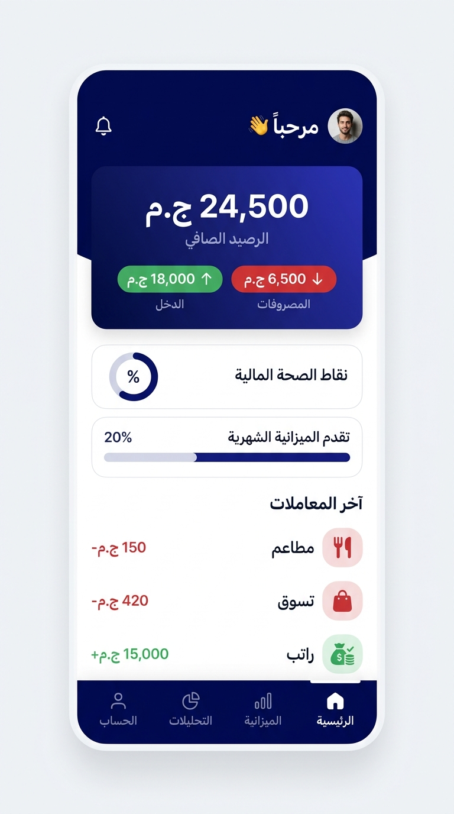
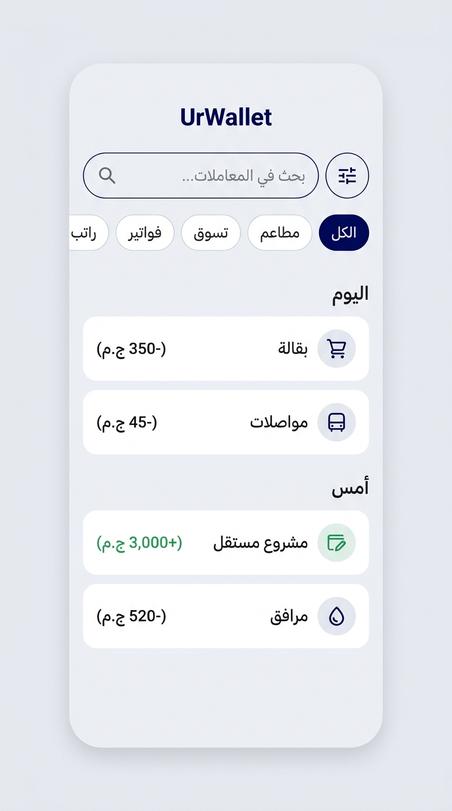
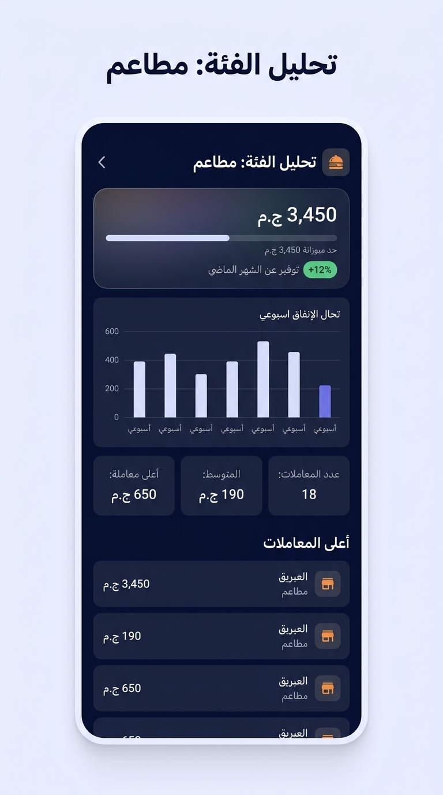
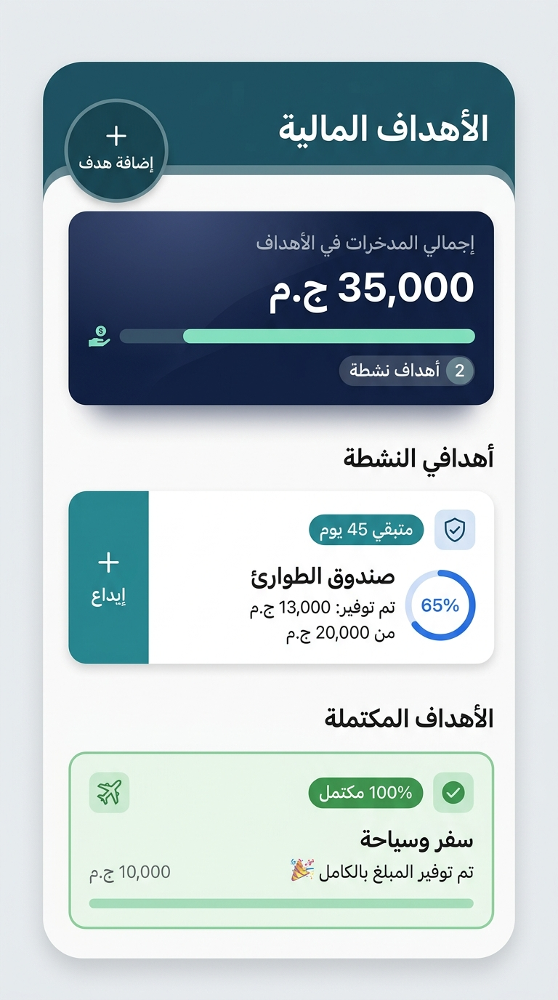

# UrWallet 💳

<div align="center">

### **Your money, smarter.**

A privacy-first personal finance Android app built with **native Kotlin**, **Jetpack Room**, and **Feature-First Clean Architecture**. UrWallet is designed around an **offline-first experience**, keeping financial data on the device while providing practical tools for tracking spending, understanding financial habits, and reaching savings goals.

[](https://kotlinlang.org)
[](https://developer.android.com)
[](https://developer.android.com/topic/architecture)
[](https://dagger.dev/hilt/)
[](https://developer.android.com/training/data-storage/room)
[](https://junit.org)

</div>

---

## 📱 App Preview

<div align="center">

| Dashboard | Transactions |
| :---: | :---: |
|  |  |

| Analytics | Goals & Savings |
| :---: | :---: |
|  |  |

</div>

---

## ✨ Features

### 💰 Personal Finance Management

- **Dashboard** — Get a quick overview of current balance, monthly income, monthly expenses, recent transactions, and financial health.
- **Income & Expense Tracking** — Record transactions with categories, notes, dates, and transaction types.
- **Transaction Search** — Search instantly by transaction name or notes.
- **Advanced Filtering** — Filter by income/expense type, category, and date range.
- **Smart Date Grouping** — Automatically organize transactions into Today, Yesterday, and historical dates.
- **Transaction Details** — View complete transaction information and share transaction details.

### 📊 Analytics & Financial Insights

- **Category Analytics** — Analyze spending by category with total spending, transaction count, average transaction value, and highest transaction.
- **Monthly Comparison** — Compare current spending with the previous month to understand changes in financial behavior.
- **Financial Health Score** — Get a simple snapshot of monthly spending relative to income and budget.
- **Visual Insights** — Present financial data through charts and clear visual summaries.

### 🎯 Goals & Savings

- **Financial Goals** — Create and manage multiple savings goals with target amounts and deadlines.
- **Goals Overview** — See total savings across all goals and overall progress at a glance.
- **Goal Detail** — Track individual goal progress and contribution history.
- **Smart Saving Pace** — Calculate the required monthly contribution based on configurable pace modes such as Relaxed, Balanced, and Fast.
- **Contribution Presets** — Quickly add commonly used contribution amounts.
- **Contribution History** — Keep a detailed record of contribution amount, date, time, and notes.
- **Deadline Awareness** — Highlight goals approaching their target date.
- **Completion Tracking** — Detect fully funded goals and present them as completed achievements.
- **Goal Management** — Add, contribute to, view, and delete goals through dedicated workflows.

### 🧭 Onboarding & Financial Habits

- **Guided Onboarding** — Introduce the app and its core financial concepts through a structured wizard.
- **Financial Education** — Present practical budgeting and saving guidance, including the 50/30/20 rule and awareness of small recurring expenses.

### 🔒 Privacy & Offline-First Design

- **Local-First Data** — Financial data is stored locally on the device rather than relying on a cloud backend.
- **Room Database** — Persistent structured storage backed by SQLite through Android Jetpack Room.
- **Reactive Updates** — UI data updates automatically using Kotlin `Flow` and `StateFlow`.
- **No Network Dependency for Core Finance Data** — Core tracking and goal workflows are designed around local data access.

---

## 🏗️ Architecture

UrWallet follows a **Feature-First Clean Architecture** with **MVVM** and a reactive data flow:

```text
UI / Fragment
     ↓
ViewModel
     ↓
UseCase
     ↓
Repository
     ↓
DAO
     ↓
Room Database
```

Project organization is centered around features rather than technical layers:

```text
app/src/main/java/com/example/urwallet/
│
├── core/
│   ├── common/          # Date utilities, formatters, enums, state models
│   ├── database/        # Room database, converters, migrations
│   └── designsystem/    # Theme, colors, dimensions, category mappings
│
└── features/
    ├── dashboard/
    ├── transactions/
    ├── analytics/
    ├── goals/
    └── onboarding/
```

### Engineering Principles

- **Single Source of Truth** — Goal progress and saved amounts are derived from contribution records rather than duplicated mutable totals.
- **Unidirectional Data Flow** — Data moves from Room through Repository and UseCase layers into `ViewModel` state exposed to the UI.
- **Separation of Concerns** — UI components focus on presentation while business rules remain in the domain layer.
- **Dependency Injection** — Dependencies are provided through **Dagger Hilt**.
- **Reactive State** — `Flow` and `StateFlow` keep the interface synchronized with database changes.
- **Domain-Driven Calculations** — Goal calculations are centralized in dedicated domain logic instead of being scattered across UI code.

---

## 🛠️ Tech Stack

| Technology | Purpose |
| --- | --- |
| **Kotlin** | Application development |
| **Android XML + Material 3** | Native UI |
| **ViewBinding / DataBinding** | View access and binding |
| **Jetpack Room** | Local SQLite persistence |
| **Kotlin Coroutines** | Asynchronous programming |
| **Flow / StateFlow** | Reactive state and data streams |
| **Dagger Hilt** | Dependency injection |
| **Navigation Component** | Screen navigation |
| **Safe Args** | Type-safe navigation arguments |
| **JUnit 4** | Unit testing |
| **MockK** | Mocking dependencies in tests |
| **Truth** | Fluent test assertions |

---

## 🧪 Testing & Quality

The project includes unit tests covering key business logic and data flows, including:

- Goal calculation logic (`GoalCalculatorTest`)
- Use cases
- Repository behavior
- Financial and goal-related calculations

Run the unit test suite with:

```bash
./gradlew testDebugUnitTest
```

> **Current test status:** 62 unit tests passing.

---

## 🚀 Getting Started

### Requirements

- **Android Studio** Ladybug (2024.2.1) or newer
- **JDK 17** or newer
- **Android SDK** with Min SDK 26 and Target SDK 34

### Clone the repository

```bash
git clone https://github.com/KareemEzzat91/UrWallet.git
cd UrWallet
```

### Build the project

```bash
./gradlew assembleDebug
```

Then open the project in Android Studio and run it on an emulator or physical Android device.

---

## 📁 Project Highlights

UrWallet is intentionally structured to make the codebase easier to scale and maintain. Each major business capability lives inside its own feature module, while shared concerns are kept inside `core`.

The goals module is a good example of this approach, separating local data sources, repositories, domain models, calculators, use cases, adapters, fragments, and view models into clear responsibilities.

---

## 🔐 Privacy Note

UrWallet is designed around a local-first personal finance model. The application's core financial data is stored locally using Room rather than being dependent on a remote cloud database.

---

## 📄 License

This project is available under the [MIT License](LICENSE).

<div align="center">

**Built with Kotlin and a focus on privacy, maintainability, and practical personal finance.** ❤️

</div>
