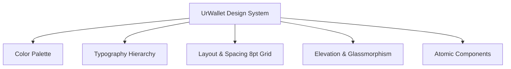
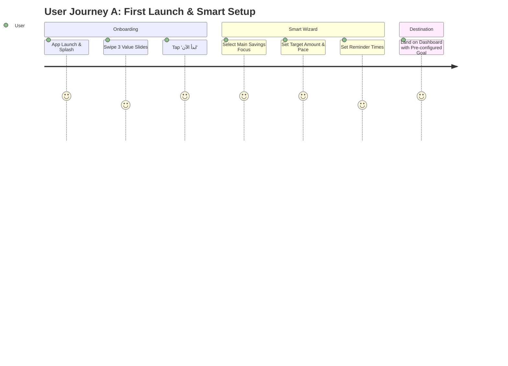

# UrWallet — Comprehensive Product Design, System & User Scenarios Specification

> **Product Name:** UrWallet (محفظتك، بس أذكى — *Your Wallet, But Smarter*)  
> **Tagline:** Your intelligent, Arabic-first offline money coach.  
> **Target Platforms:** Mobile (Flutter / Android API 26+)  
> **Design Source of Truth:** Figma Document (`ShQJ1qhXf15TpQpSkKIbIs`, node `0:1`)

---

## 1. Executive Product Vision & Core Philosophy

UrWallet is an **Arabic-first, intelligent personal finance application** built to act as a **personal financial coach** rather than a mere transactional spreadsheet.

### Core Pillars
1. **Offline-First Resilience:** 100% of features (logging transactions, tracking budgets, goal calculators, recurring rules, analytics) work offline with local storage (Room/SQLite).
2. **Actionable Financial Coaching:** Instead of passive logs ("Spent 500 EGP"), UrWallet delivers proactive insights ("Food spending is up 18% this week; cutting back 500 EGP/month will help you reach your iPhone 15 goal 2 months faster").
3. **Arabic-First UX & Ergonomics:** Full Right-to-Left (RTL) fidelity, localized typography (IBM Plex Sans Arabic), intuitive iconography, and natural Egyptian Arabic financial phrasing.
4. **Data Privacy & Ownership:** User financial data is strictly stored on-device with encrypted local backups, PIN/Biometric lock, and zero forced cloud dependencies.

---

## 2. Complete Design System & Visual Tokens



### 2.1 Color Palette
| Token Name | Hex Code | Visual Role & Semantic Meaning |
|---|---|---|
| `Primary` | `#000666` / `#0A1172` | Royal Navy — primary buttons, active state, hero cards, prominent numbers |
| `Primary Light` | `#E8EAF6` / `#EEF0FF` | Backgrounds of selected category chips, badge pills, active indicators |
| `Secondary Accent` | `#1A237E` ➔ `#4C56AF` | Dynamic gradient used for hero balance cards, challenge headers |
| `Income / Success` | `#00732C` / `#00C853` | Income transactions (`+`), goal progress bars, challenge achievements |
| `Expense / Danger` | `#BA1A1A` / `#D32F2F` | Expense transactions (`-`), budget overages (>100%), destructive delete |
| `Warning / Alert` | `#FBBC00` / `#FF9800` | Budget warning badges (>80%), smart proactive alert banners |
| `Surface Light` | `#FFFFFF` | Primary card background, bottom sheets, input containers |
| `Surface Glass` | `rgba(255, 255, 255, 0.7)` | Frosted glass cards with `backdrop-filter: blur(12px)` |
| `Background` | `#F8F9FA` / `#F4F5F6` | Cool neutral background canvas for maximum contrast and legibility |
| `Text Primary` | `#191C1D` | Headings, amounts, primary labels (soft carbon black) |
| `Text Secondary` | `#454652` / `#767683` | Timestamps, notes, secondary subtitles, hints |
| `Borders / Dividers` | `rgba(198, 197, 212, 0.35)` | Subtle borders around cards, text fields, and list separators |

### 2.2 Typography System (IBM Plex Sans Arabic)
* **Hero Display (Big Numbers):** 36sp – 44sp | Bold | Numerals & Amounts
* **Title Large (Screen Headers):** 22sp – 24sp | Bold | e.g., "التحليل المالي", "محفظتك"
* **Title Medium (Section Headers):** 18sp – 20sp | SemiBold | e.g., "آخر المعاملات", "أهدافي الحالية"
* **Body Large (Card Titles / Values):** 15sp – 16sp | Medium | e.g., Category names, Merchant names
* **Body Medium (Descriptions / Notes):** 13sp – 14sp | Regular | Insights, transaction dates
* **Caption / Label (Badges & Hints):** 11sp – 12sp | Regular/Medium | e.g., "52% مستخدم", "باقي 3 أيام"

### 2.3 Shapes, Border Radii & Elevation
* **Cards & Containers:** `16dp` – `20dp` rounded corners (`RoundedRectangleBorder(BorderRadius.circular(20))`)
* **Buttons & Text Fields:** `12dp` – `14dp` rounded corners
* **Pills, Chips & Icon Badges:** `9999dp` (Capsule/Circle)
* **Shadows:**
  * Standard Card: `0dp 2dp 8dp rgba(0, 6, 102, 0.05)`
  * Hero Balance Card: `0dp 8dp 24dp rgba(0, 6, 102, 0.14)`
  * Floating Action Button (FAB): `0dp 6dp 16dp rgba(0, 6, 102, 0.28)`

---

## 3. Information Architecture & Navigation

UrWallet utilizes a 4-tab Persistent Bottom Navigation Bar with a prominent Floating Action Button (FAB).

```
                      ┌────────────────────────────────────────┐
                      │             UrWallet App               │
                      └───────────────────┬────────────────────┘
                                          │
        ┌───────────────────┬─────────────┴───────┬────────────────────┐
        ▼                   ▼                     ▼                    ▼
  [1. الرئيسية]       [2. المعاملات]          [3. أهدافي]           [4. المزيد]
  (Dashboard)         (Transactions)            (Goals)              (More Hub)
   ├── Hero Card       ├── Search & Filters    ├── Goal Cards        ├── Analytics & AI
   ├── Quick Actions   ├── Category Breakdown  ├── Smart Wizard      ├── Budgets
   ├── Smart Insight   ├── Add Transaction     ├── Add Money Sheet   ├── Challenges
   ├── Quick Glance    └── Detail/Edit/Delete  └── Goal Progress     ├── Habits
   ├── Active Goal                                                   ├── Recurring Bills
   └── Recent 4 List                                                 ├── Categories
                                                                     ├── App Lock / PIN
                                                                     └── Data Backup
```

---

## 4. Screen-by-Screen Specifications (Mapped to Figma Sections)

### Section 1: `onboardingAndSplash` (First Run & Value Proposition)

| Screen Name | Node ID | Purpose & Key Elements |
|---|---|---|
| **Splash Screen (شاشة البداية)** | `2002:1424` | Minimalist branded screen with 3D logo, app name "UrWallet", tagline "محفظتك، بس أذكى.", and instant local database pre-warm. |
| **Slide 1: Expense Tracking (التتبع)** | `2002:1312` | Value: "اعرف فلوسك رايحة فين" — 3D asset of tracking graph, smooth dots indicator, Skip ("تخطي") and Next ("التالي") actions. |
| **Slide 2: Goal Reaching (الأهداف)** | `2002:1339` | Value: "حقق أهدافك" — 3D asset of car/house goals, smart pacing value proposition. |
| **Slide 3: Habit Formation (العادات)** | `2002:1362` | Value: "طوّر عاداتك المالية" — Dark glassmorphic card showcasing "المخطط الذكي" badge and "ابدأ الآن →" CTA button. |

---

### Section 2: `الرئيسية` (Dashboard Hub)

| Component / Sub-Frame | Node ID | Layout & Behavior Specs |
|---|---|---|
| **Top App Bar (Header)** | `2002:1626` | Right: User Avatar + Name greeting ("مساء الخير، كريم 👋"). Left: Notification Bell with unread indicator dot. |
| **Hero Balance Card** | `2002:1444` | Total Current Balance ("5,850 ج.م"), Income pill ("+12,400 ج.م" green arrow down), Expense pill ("-6,550 ج.م" red arrow up). |
| **Quick Actions Row** *(P0 Added)* | — | 4 circular buttons: **[تحويل Transfer]**, **[إيداع Deposit]**, **[سحب Withdraw]**, **[دفع Pay]** for rapid 1-tap logging. |
| **Smart Insight Banner** | `2002:1444` | Golden bulb icon: "مصروفات الأكل زادت 18% عن الأسبوع اللي فات. حاول تقليل طلبات الدليفري." |
| **Quick Glance Bento Grid** | `2002:1444` | 2 cards: Today's Spend ("320 ج.م") + Budget Remaining ("4,200 ج.م"), plus weekly spend trend chart. |
| **Active Daily Challenge** | `2002:1444` | Gradient card: "تحدي اليوم 🔥 — حاول تعدي اليوم من غير مصاريف غير ضرورية." |
| **Active Goal Tracker** | `2002:1444` | Nearest goal card ("آيفون 15 برو — 15,500 / 50,000 ج.م (31%)") + "عرض الكل" link. |
| **Recent Transactions List** | `2002:1444` | Last 4 transactions with category icon, merchant title, timestamp, and amount. "سجل المعاملات" link to Tab 2. |
| **Floating Action Button (FAB)** | `2002:1622` | Pinned circular button (`#000666`, white `+`) with ripple animation, opening Add Transaction sheet. |

---

### Section 3: `المعاملات` (Transactions, Filtering & Deep Dive)

| Screen / Modal | Node ID | Layout & Behavior Specs |
|---|---|---|
| **Transactions Master List** | `2021:451` | Search bar at top, Filter button, grouped by dates ("اليوم", "أمس", "12 أكتوبر"). Smooth swipe-to-delete. |
| **Search View** | `2021:446` | Live search by merchant or category name, clear button (`✕`), item count indicator ("4 نتائج موجودة"). |
| **Filter Bottom Sheet** | `2021:448` | Multi-select chips for Type (`الكل` / `دخل` / `مصروف`), Category chips, Period radio (`اليوم` / `هذا الأسبوع` / `هذا الشهر` / `مخصص`), Price Range Slider. |
| **Add Transaction Form** | `2021:450` | Toggle `[مصروف | دخل]`. Big amount display with numeric keypad. 8 category grid. Date & Time picker. Receipt photo upload box. |
| **Transaction Details Screen** | `2021:449` | Large category icon badge, merchant name, colored amount (`-320.00 ج.م`), details table (Type, Category, Date, Time, Note), full receipt image preview, action buttons: **[تعديل Edit]**, **[مشاركة Share]**, **[حذف Delete]**. |
| **Category Deep Dive (تحليل الفئة)** | `2021:447` | Category header (e.g. "الأكل 🍔"), Total spent ("2,400 ج.م" `+23%`), Average per transaction ("200 ج.م"), Budget alert box, Top 3 merchant breakdown. |

---

### Section 4: `اهدافي` (Goals Management & Tracking)

| Screen / Modal | Node ID | Layout & Behavior Specs |
|---|---|---|
| **Goals Overview Screen** | `2020:10` | Hero card: Total Active Goals count ("3 أهداف"), Remaining amount ("60,000 ج.م"), status pill ("أنت على الطريق الصحيح!"). List of active goal cards with percentage rings. Completed goals section at bottom. |
| **New Goal Screen (هدف جديد)** | `2002:2583` | Goal icon avatar with edit badge, Goal Name input, Target Amount, Initial Saved Amount (optional), Target Date picker, Monthly calculation estimate pill ("هتحتاج توفر تقريباً 1,250 ج.م شهرياً"). |
| **Icon Picker Grid (اختر أيقونة الهدف)**| `2002:4259` | Searchable grid of financial & lifestyle icons (Car, House, Airplane, Shield, Laptop, Ring, Books, Gift, Shopping). |
| **Goal Details Screen** | `2002:2146` | Large 31% radial progress ring, Saved amount vs Remaining amount card, Smart Advisor Insight ("لو زودت ادخارك 500 ج.م شهرياً..."), Timeline date, Recent Contributions list with `+` buttons. |
| **Add Money Bottom Sheet** | `2002:3453` | Mini goal progress bar, Amount input field, Note field, "إضافة المبلغ" CTA button. |

---

### Section 5: `الادخار` (Smart Financial Coach Savings Wizard)

| Screen / Step | Node ID | Layout & Behavior Specs |
|---|---|---|
| **Step 1: Goal Focus (تركيز الادخار)** | `2002:4210` | 4 Cards: [صندوق الطوارئ Emergency], [السفر Travel], [منزل جديد Home], [التقاعد Retirement], [هدف مخصص Custom]. |
| **Step 2: Target Amount (تحديد الهدف)** | `2002:4154` | Big target amount input ("5,000 ج.م"), slider selector (0 to 50,000+), Quick preset chips (1,000 / 5,000 / 10,000 / 20,000). |
| **Step 3: Savings Plan (خطة الادخار)** | `2002:4328` | Smart Pace Slider: **[هادئ Relaxed]** / **[متوازن Balanced]** / **[مكثف Aggressive]**. Automatically calculates required monthly deposit ("1,250 ج.م شهرياً للوصول خلال 4 أشهر"). |
| **Step 4: Reminders (تنبيهات الادخار)** | `2002:4408` | Reminder switches (Weekly reminder, Monthly report, Deadline alert, Motivational nudges) + Preferred reminder time picker ("09:00 م"). |
| **Step 5: Habits (عادات الادخار)** | `2002:4534` | Educational rule cards: **50/30/20 Rule**, **Automated Savings**, **Micro-expenses tracking**, **SMART Goal setting**. |

---

### Section 6: `المزيد` (More Hub, Advanced Analytics & System Settings)

| Feature / Screen | Node ID | Layout & Behavior Specs |
|---|---|---|
| **More Menu Master Grid** | `2002:2270` | User summary card + 8 grid tiles (Analytics, Habits, Notifications, Challenges, Budgets, Profile, Categories, Recurring) + 3 bottom list items (Contact, About, App Lock). |
| **Financial Analytics (التحليل المالي)** | `2002:1771` | Month picker dropdown, Total Income vs Expense cards, Net Balance card ("5,850 ج.م"), Weekly spending bar chart, Category budget vs actual progress bars, Upcoming bill alert. |
| **Financial Health (الصحة المالية)** | `2002:2837` | Radial score (78/100), 3 metric bars: Planning 85%, Saving 60%, Control 72%. Tailored advice cards based on spending pattern. |
| **Financial Habits (عاداتك المالية)** | `2002:2050` | Financial Personality Card ("المخطط الذكي 🧠"), Peak spending day ("السبت"), Top category ("المطاعم والكافيهات"), Daily average spend ("210 ج.م"). |
| **Saving Challenges (تحديات الادخار)** | `2002:2739` | 3 interactive cards: **7-Day No Spend Challenge 🔥**, **Coffee Savings Challenge ☕**, **1,000 EGP Monthly Challenge 💰** with progress bars and "متابعة" buttons. |
| **Monthly Budgets (الميزانيات)** | `2002:3808` | Monthly overall consumption gauge (78%), List of category budgets with color-coded warning chips (Healthy / Close to Limit / Exceeded). |
| **Recurring Transactions (المعاملات المتكررة)**| `2002:3986` | List of repeating items: Salary (`+15,000`), Rent (`-4,000`), Internet (`-500`), Subscriptions (`-150`) with due date tags ("كل شهر • القادم: 1 سبتمبر"). |
| **Category Management (الفئات)** | `2002:3744` | 8 default category tiles with 3D icons, "إضافة فئة" button at bottom. |
| **Data Management & Backup (إدارة البيانات)**| `2002:3387` | Dark mode surface: Local backup creation, Export to JSON/CSV, Import backup file, Destructive "حذف جميع البيانات" button with red safety prompt. |
| **App Lock & PIN Setup (قفل التطبيق)** | `2002:4081` | 3-step wizard (Set PIN -> Confirm PIN -> Biometrics toggle), customized Arabic numpad with delete key. |
| **Notifications Center (الإشعارات)** | `2002:2399` | Grouped alerts: Goal milestone reached, Challenge streak kept, Weekly spending spike, Daily logging reminder. |
| **Profile Settings (الملف الشخصي)** | `2002:2979` | Avatar upload with camera icon, Full Name field, Default Currency dropdown (EGP, SAR, USD, EUR, etc.). |
| **General Settings (الإعدادات)** | `2002:3087` | Toggles for Dark Mode, Language (العربية / English), Default Currency, Notification preferences, App lock entry. |
| **About UrWallet (عن التطبيق)** | `2002:3218` | App version (v1.0.0), Privacy Policy, Terms & Conditions, Support contact link. |

---

### Section 7: `temp` (System States, Empty States & Micro-Feedbacks)

| State / Component | Node ID | Layout & Behavior Specs |
|---|---|---|
| **Empty Transactions State** | `2002:3674` | 3D empty wallet illustration: "لسه مفيش معاملات — ابدأ بتسجيل أول مصروف ليك" + CTA button `[إضافة معاملة]`. |
| **Empty Goals State** | `2002:3674` | 3D mountain/path illustration: "لسه مفيش أهداف — حدد أول هدف وابدأ رحلتك" + CTA button `[هدف جديد]`. |
| **Success Toast / Snackbar** | `2002:3025` | Green pill badge: "تم حفظ المعاملة بنجاح ✓" displayed for 2.5 seconds with haptic feedback. |
| **Delete Confirmation Dialog** | `2002:3025` | Red accent dialog: "حذف المعاملة؟ هل أنت متأكد إنك عايز تحذف المعاملة دي؟" with `[حذف]` (destructive red) and `[إلغاء]` (neutral). |
| **Skeleton Loading Placeholders**| `2002:3025` | Shimmering card placeholders with avatar & text line skeletons for seamless offline data retrieval. |

---

## 5. End-to-End User Journeys (Scenarios A through J)



### 🟢 Scenario A: First Launch & First Goal Setup
1. **Trigger:** User installs UrWallet and launches for the first time.
2. **Step 1:** Splash screen (04) initializes Room database and displays branding.
3. **Step 2:** User swipes through 3 onboarding slides highlighting Expense Tracking, Smart Goals, and Habits.
4. **Step 3:** User taps "ابدأ الآن →".
5. **Step 4:** Instead of dumping the user onto an empty screen, the app opens the **Smart Savings Wizard (Section `الادخار`)**:
   - User picks a primary focus (e.g. "صندوق الطوارئ" or "آيفون جديد").
   - User enters target amount (e.g. "10,000 ج.م") using the interactive slider.
   - User adjusts the pace slider (هادئ / متوازن / مكثف). The app calculates: "وفر 1,250 ج.م شهرياً".
6. **Outcome:** User lands on the Dashboard with their first active goal pre-loaded, giving an immediate sense of accomplishment and clarity.

---

### 🟢 Scenario B: Quick Daily Expense Logging (< 5 Seconds Flow)
1. **Trigger:** User buys a coffee or pays a grocery bill.
2. **Step 1:** User taps the prominent Floating Action Button (`+`) on Dashboard or Transactions tab.
3. **Step 2:** `Add Transaction` sheet slides up with amount input pre-focused.
4. **Step 3:** User enters `120`, taps the `أكل` (Food) category chip. Date and Time default to `Now`.
5. **Step 4:** (Optional) User taps camera icon to attach a receipt or types a quick note ("ستاربكس").
6. **Step 5:** User taps `حفظ المعاملة` (Save Transaction).
7. **Outcome:** 
   - Instant green snackbar: "تم حفظ المعاملة بنجاح ✓" with haptic tick.
   - Balance decreases by 120 EGP in real-time.
   - Category budget bar updates dynamically.

---

### 🟢 Scenario C: Income Logging & Dynamic Category Switch
1. **Trigger:** User receives their monthly salary or freelance payment.
2. **Step 1:** User taps `+` FAB.
3. **Step 2:** User taps the toggle `دخل` (Income).
4. **Step 3:** The category grid instantly switches from expense categories to income categories (*راتب Salary, عمل حر Freelance, استثمار Investment, مكافأة Bonus, أخرى Other*).
5. **Step 4:** User enters `15,000`, selects `راتب`, taps `حفظ المعاملة`.
6. **Outcome:** Total Balance and Income metrics increase with positive green formatting (`+15,000 ج.م`).

---

### 🟢 Scenario D: Reviewing & Filtering Transactions
1. **Trigger:** User wants to see how much they spent on "Supermarket/Groceries" this month.
2. **Step 1:** User navigates to Tab 2 (`المعاملات`).
3. **Step 2:** User taps the `تصفية` (Filter) button next to the search bar.
4. **Step 3:** Filter Bottom Sheet opens: User selects Type: `مصروف`, Category: `تسوق`, Period: `هذا الشهر`.
5. **Step 4:** User taps `تطبيق الفلاتر` (Apply Filters).
6. **Outcome:** The list filters instantly with a summary counter ("4 معاملات — إجمالي 2,400 ج.م").

---

### 🟢 Scenario E: Goal Contribution & Smart Acceleration
1. **Trigger:** User has extra savings and wants to deposit money into their "iPhone 15" goal.
2. **Step 1:** User taps on Tab 3 (`أهدافي`) or the goal card on Dashboard.
3. **Step 2:** User opens `Goal Details` screen (10), seeing current progress at 31% (18,500 / 60,000 EGP).
4. **Step 3:** User reads the smart coaching tip: *"لو زودت ادخارك 500 ج.م شهرياً هتوصل لهدفك أسرع بحوالي شهرين."*
5. **Step 4:** User taps `+ إضافة مبلغ`. Bottom sheet (24) opens.
6. **Step 5:** User enters `1,500` EGP, adds note "إيداع يدوي", taps `إضافة المبلغ`.
7. **Outcome:** Progress ring animates smoothly from 31% to 33.5%, saved amount updates to 20,000 EGP, and the contribution is logged in history.

---

### 🟢 Scenario F: Budget Warning & Overspending Alerts
1. **Trigger:** User's food spending reaches 90% of the allocated monthly limit (1,800 / 2,000 EGP).
2. **Step 1:** When user logs another food expense, the app evaluates the budget threshold locally.
3. **Step 2:** On Dashboard and Budget screen (28), the food budget chip turns yellow/red: `90% - قريب من الحد ⚠️`.
4. **Step 3:** Top alert card on Dashboard displays: *"تنبيه: اقتربت من ميزانية الأكل (المتبقي 200 ج.م حتى نهاية الشهر)"*.
5. **Outcome:** User is warned proactively without interrupting their ability to log transactions.

---

### 🟢 Scenario G: Recurring Transaction Automation
1. **Trigger:** The 1st of the month arrives for rent or subscription payments.
2. **Step 1:** The local background worker (`WorkManager`) triggers on the scheduled date.
3. **Step 2:** Recurring rule (e.g. "الإيجار - 4,000 ج.م") automatically records the transaction.
4. **Step 3:** User receives a local notification: *"تم تسجيل معاملة الإيجار الشهرية تلقائياً بقيمة 4,000 ج.م"*.

---

### 🟢 Scenario H: Financial Coach Deep Dive & Habits Analysis
1. **Trigger:** User wants to understand their spending habits over the last 30 days.
2. **Step 1:** User goes to Tab 4 (`المزيد`) ➔ `التحليل المالي`.
3. **Step 2:** User views the spending trend bar chart, top spending days ("السبت"), and category breakdown.
3. **Step 3:** User views their Financial Health Score (`78/100`) and Money Personality (`المخطط الذكي`).
4. **Outcome:** User receives actionable recommendations instead of raw numbers.

---

### 🟢 Scenario I: Local Data Backup & Security Lock
1. **Trigger:** User wants to backup their data before switching phones or secure the app with a PIN.
2. **Step 1:** User goes to `المزيد` ➔ `قفل التطبيق` (30), enters a 4-digit PIN, confirms it, and enables Biometrics.
3. **Step 2:** User goes to `إدارة البيانات` (23), taps `تصدير البيانات` (Export Data).
4. **Step 3:** App generates an encrypted JSON file stored locally or shareable via Android Share Sheet.
5. **Outcome:** Zero data leak, 100% offline ownership.

---

## 6. Offline-First Synchronization & Architecture Rules

```
┌────────────────────────────────────────────────────────┐
│                   PRESENTATION LAYER                   │
│   Screens / Widgets (Stateless, Theme-driven, RTL)     │
└───────────────────────────▲────────────────────────────┘
                            │ (State Flow / Streams)
┌───────────────────────────┴────────────────────────────┐
│                STATE MANAGEMENT (Cubit/Bloc)           │
│   Emits: Initial ➔ Loading ➔ Loaded / Success ➔ Error │
└───────────────────────────▲────────────────────────────┘
                            │ (Executes)
┌───────────────────────────┴────────────────────────────┐
│                    DOMAIN USE CASES                    │
│   e.g. AddTransactionUseCase, CalculateGoalPaceUseCase  │
└───────────────────────────▲────────────────────────────┘
                            │ (Repository Interface)
┌───────────────────────────┴────────────────────────────┐
│                 DATA LAYER (Offline Source)            │
│   Room Database (Transactions, Goals, Budgets, Habits) │
│   DataStore (Preferences, Currency, Theme, PIN)        │
└────────────────────────────────────────────────────────┘
```

### Golden Engineering Rules (User Guidelines Compliance)
1. **UI Never Directly Touches Storage:** Presentation widgets only observe Cubit/Bloc states.
2. **SizedBox for Spacing:** Standard spacing tokens (8dp, 16dp, 24dp, 32dp) via `SizedBox(height/width: 16)`. No arbitrary repeated magic numbers.
3. **ThemeData and TextTheme:** No hardcoded font colors or sizes in UI code. All colors refer to `AppColors` and `Theme.of(context).textTheme`.
4. **Const Constructors:** 100% enforced on all static widgets to minimize rebuild scope and maintain 60/120fps scrolling.
5. **Arabic RTL Standard:** All layouts use `Directionality(textDirection: TextDirection.rtl)`. Back buttons point right `→`, forward chevrons point left `←`.
